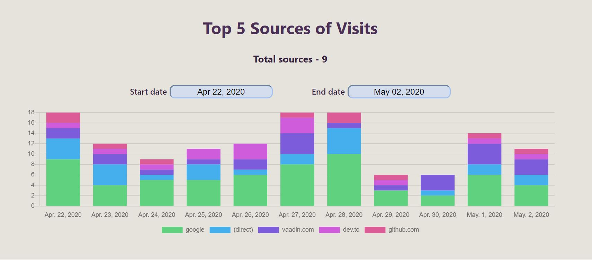

# Jugaadu-Analytics-Dashboard

Custom Jugaadu Analytics Dashboard based on Google Analytics Reporting API v4 with OAuth2, charts and tables.

    
    
    
    
    
    

## Technologies used

- [React.js](https://reactjs.org/)
- [Google Analytics API](https://developers.google.com/analytics/devguides/reporting/core/v4)
- [React Charts](https://github.com/jerairrest/react-chartjs-2)
- [Styled Components](https://styled-components.com/)

## Run the app on your machine

1. Clone this repo
2. Create project in [Google Developers Console](https://console.developers.google.com/)
3. Enable Google Analytics Reporting API.
4. Configure Google OAuth consent screen.
5. Add your CLIENT_ID into .env file:
   REACT_APP_CLIENT_ID='YOUR_CLIENT_ID'
6. Run `npm install`
7. Run `npm start`

1. *Get the code:*  
   - Find the command to "clone" this project. Cloning creates a copy of the project on your computer.

2. *Set up Google project:*  
   - Go to [https://console.cloud.google.com/](https://console.cloud.google.com/) and create a new project. This is needed for some features in the app.

3. *Enable Google Analytics:*  
   - Within your new Google project, turn on a feature called "Google Analytics Reporting API". This allows the app to access data from Google Analytics.

4. *Tell Google about your app:*  
   - Still in the Google project settings, there's a section for configuring "OAuth consent screen". This helps Google understand what kind of app you're building.

5. *Add your secret code:*  
   - There's a file named .env in the project. Find the line that says REACT_APP_CLIENT_ID='YOUR_CLIENT_ID'. Replace YOUR_CLIENT_ID with a special code you get from Google during the OAuth consent screen setup. This code is secret, so keep it safe!

6. *Install things the app needs:*  
   - Open a command prompt (or terminal) in the project folder. Type npm install and press enter. This downloads all the tools the app needs to run.

7. *Start the app!*  
   - In the same command prompt, type npm start and press enter. This will run the app on your computer so you can test it out.
  
This project was bootstrapped with [Create React App](https://github.com/facebook/create-react-app).
